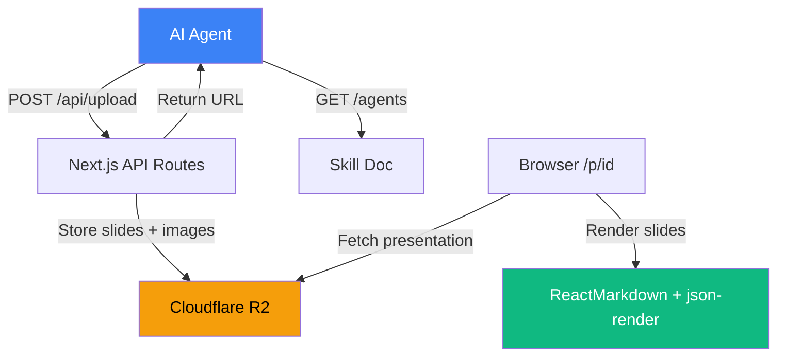

# How presentmd Was Built

A walkthrough of **presentmd** — an agent-powered markdown presentation tool built with Next.js, Cloudflare R2, and a PlanetScale-inspired UI.

<Callout type="info" title="What is presentmd?">
  presentmd lets an AI agent create and host slide decks via a REST API. The agent sends markdown, gets back a shareable link. Slides render with syntax highlighting, interactive json-render components, and a clean dark UI.
</Callout>

---

## Architecture Overview



---

## Commit 1: The Full App

The initial real commit (`c02d806`) landed the entire app in one shot — API routes, slide parser, viewer component, upload endpoint, and the PlanetScale-style dark UI.

### The Slide Parser

The core logic that turns a single markdown file into discrete slides:

<CodeDiff id="parser" />

### The Storage Layer

Presentations are stored in R2 as JSON blobs — one `_meta.json` per presentation containing the title, slides array, and creation timestamp:

<CodeDiff id="storage" />

### The Viewer

The slide viewer is a client component with keyboard navigation (arrow keys, space, home/end) and click navigation (left half goes back, right half goes forward):

<CodeDiff id="viewer" />

---

## Commit 2: The R2 Migration

<Callout type="warning" title="The Problem">
  Vercel serverless functions have a read-only filesystem. The original code tried to write presentations to disk — worked locally, failed in production.
</Callout>

The fix was moving all storage to Cloudflare R2 via the S3-compatible API:

<CodeDiff id="r2-migration" />

---

## Commit 3: json-render Components

The latest evolution added interactive components to slides via `json-render` fenced code blocks. This is what makes presentmd slides feel like a real presentation tool rather than just markdown rendering.

### The Component Catalog

A rich set of interactive UI components — cards, grids, charts, tables, tabs, accordions, toggles — all declaratively composed from JSON specs:

<CodeDiff id="json-render" />

### The Agent Prompt Update

The agents endpoint was massively expanded to teach the AI how to use every json-render component:

<CodeDiff id="agents-prompt" />

<Callout type="success" title="Result">
  With json-render, presentmd slides can include interactive bar charts, tabbed content, toggle-driven conditional visibility, and styled data tables — all from a JSON spec embedded in markdown.
</Callout>

---

## File Structure

```filetree
app/
  layout.tsx
  page.tsx
  globals.css
  agents/
    route.ts (skill doc)
  api/
    upload/
      route.ts
    presentations/
      [id]/
        route.ts
  p/
    [id]/
      page.tsx (viewer)
components/
  SlideViewer.tsx
  JsonRenderBlock.tsx
lib/
  parseSlides.ts
  r2.ts
  storage.ts
  jsonRenderCatalog.tsx
data/
  presentations.json
```

---

<FadeIn>

## Key Takeaways

<Steps>
  <Steps.Step title="Agent-first API design" step={1}>
    The entire app is designed around a single API contract: POST markdown, GET a link. The /agents endpoint teaches the AI how to use it.
  </Steps.Step>
  <Steps.Step title="R2 for serverless storage" step={2}>
    Cloudflare R2 with the S3-compatible API is the perfect serverless storage — cheap, fast, no filesystem dependency.
  </Steps.Step>
  <Steps.Step title="json-render for interactivity" step={3}>
    Declarative JSON specs let the AI create interactive, data-rich slides without writing React code.
  </Steps.Step>
</Steps>

</FadeIn>
